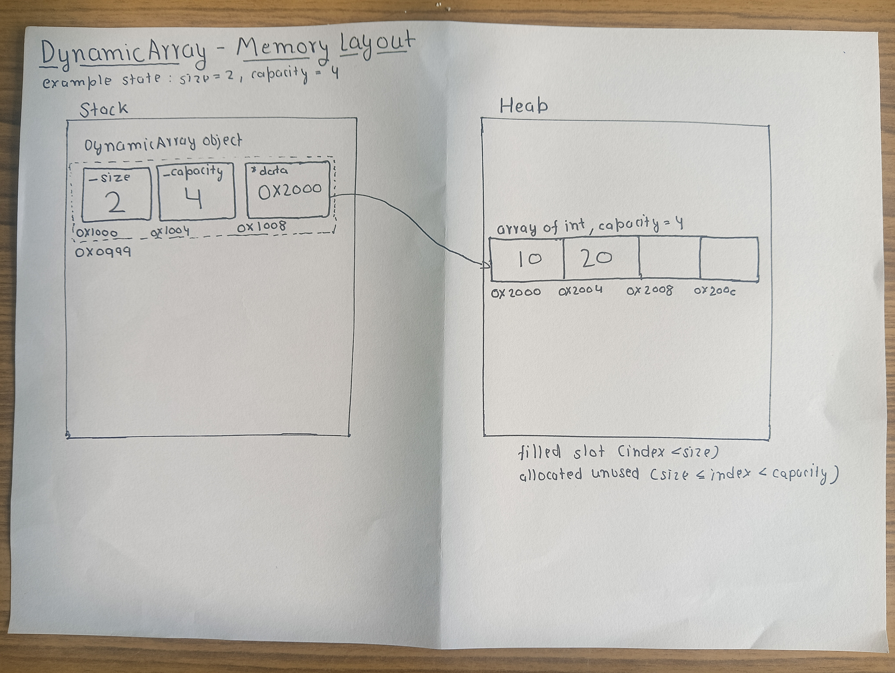

# Dynamic Array — Design Proposal

The dynamic array will be implemented using template programming so it can store any type of data like int, double, char, string, or user-defined classes. The array will automatically resize when it becomes full. It will follow the Rule of Three.

## Section A — Public Methods

**Constructor** — `DynamicArray()`
Initializes `_size = 0`, `_capacity = 0`, `data = nullptr`. Starting at zero avoids wasting memory if the array is never used.

**Destructor** — `~DynamicArray()`
Calls the destructor on every constructed element, then frees the raw block with `free()`. Required by the Rule of Three so no memory leaks when the object goes out of scope.

**Copy Constructor** — `DynamicArray(const DynamicArray& other)`
Without this, the compiler does a shallow copy — both objects would point to the same heap block, and the second destructor to run would free already-freed memory (double free). This constructor instead mallocs a new block and placement-news a copy of every element from `other`.

**Assignment Operator** — `DynamicArray& operator=(const DynamicArray& other)`
Same deep-copy reasoning as the copy constructor. Destructs and frees the old block first, then mallocs and placement-news a fresh copy of `other`'s elements.

**append** — `void append(const T& value)`
Adds `value` at position `data[size]`. If `size == capacity`, resize happens first: malloc a larger block, placement-new-copy every old element into it, destruct and free the old block, then insert the new value.

**insert** — `void insert(int index, const T& value)`
Inserts `value` at `index`, shifting every element from `index` onward one position to the right.

**remove** — `void remove(int index)`
Removes the element at `index`, shifting every element after it one position to the left, and destructs the now-unused last slot.

**get** — `T& get(int index)`
Returns the element at `index`. Throws `IndexOutOfBoundException` if `index` is out of range.

**operator[]** — `T& operator`
Same bounds check as `get()`, but returns a reference so the caller can also write: `arr[i] = value`.

**size / capacity / isEmpty**
Return `_size`, `_capacity`, and `_size == 0` respectively. All O(1) — no computation needed.

**Error handling (get / operator[])**
Both throw a custom `IndexOutOfBoundException` instead of returning a sentinel like -1. A sentinel is ambiguous — there's no way to tell an invalid index apart from -1 being a genuinely stored value — so the bug would fail silently instead of at the point it happened.

## Section B — Internal Representation

The object holds three fields — `_size`, `_capacity`, and `*data` (a pointer to the heap block). In the example, `_size = 2` and `_capacity = 4`: two slots are filled, two are allocated but unused. `*data` points to the first slot of the heap array.

## Section C — Complexity Estimates

| Operation | Complexity | Why |
|---|---|---|
| Constructor | O(1) | Just initializes three fields to zero/nullptr |
| Destructor | O(n) | Every constructed element must be destructed before the block is freed |
| Copy constructor | O(n) | New block allocated, every element placement-new-copied |
| operator= | O(n) | Old block destructed and freed, new block allocated and copied |
| append | O(1) amortized, O(n) worst case | Normally just writes to `data[size]`. On resize, all n elements are copied — but resizes happen at doubling intervals, so cost averages to O(1) per call |
| insert | O(n) | Elements from `index` onward shift right; worst case (index 0) shifts all n |
| remove | O(n) | Elements after `index` shift left; worst case (index 0) shifts all n |
| get | O(1) | Direct index calculation, `data[i]` |
| operator[] | O(1) | Same as get, returns reference instead of value |
| size / capacity / isEmpty | O(1) | Just returns a stored field |

## Section D — Design Decisions

**Heap over stack.** Array size isn't known until runtime, and stack arrays are fixed-size at compile time. Heap memory lets the array grow.

**Doubling over fixed increment.** Doubling capacity on resize means resizes happen at powers of two — roughly log₂(N) resizes for N appends, with total copy work around 2N. A fixed increment (e.g. +1 slot each time) would resize on almost every append, pushing total copy work toward O(N²). Doubling is why append is O(1) amortized.

**malloc + placement new over plain malloc.** Plain malloc only reserves bytes — it doesn't construct objects. Since the array must support types like `string` that manage their own internal heap memory, every element is constructed with placement new after `malloc`, and destructed explicitly before `free()`. This is applied to all types, not just non-primitive ones, to keep the resize/destructor logic identical regardless of `T`.

**Exception over sentinel for invalid index.** A sentinel value like -1 can't be distinguished from a legitimately stored -1, so an invalid access would silently continue with wrong data. An exception stops execution at the exact point of the error instead.

**get() and operator[] kept separate.** Both bounds-check identically. `get()` returns by value for safe reading; `operator[]` returns a reference so the caller can also assign, e.g. `arr[i] = value`.
